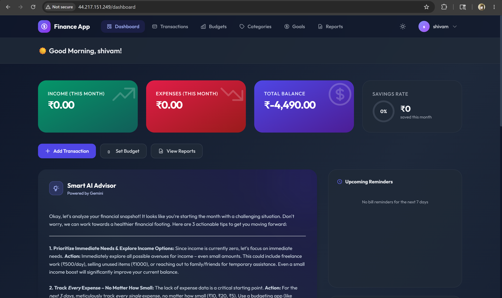
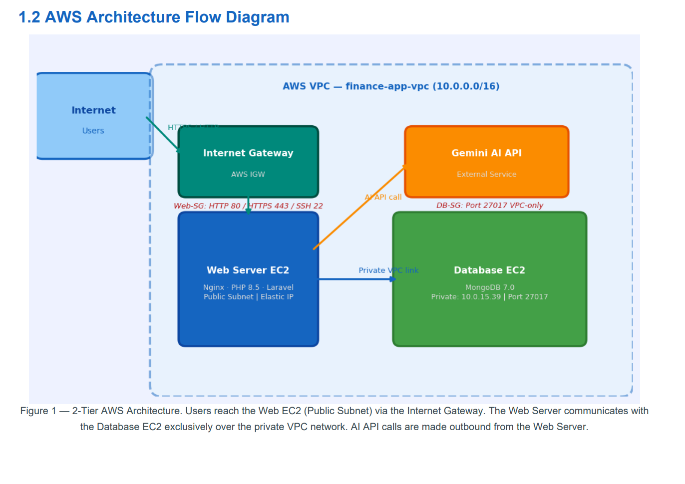
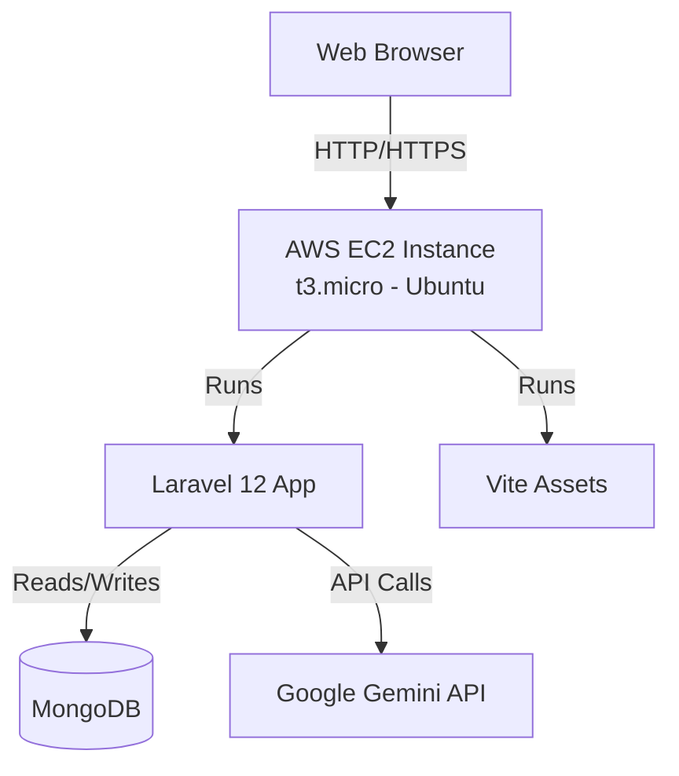
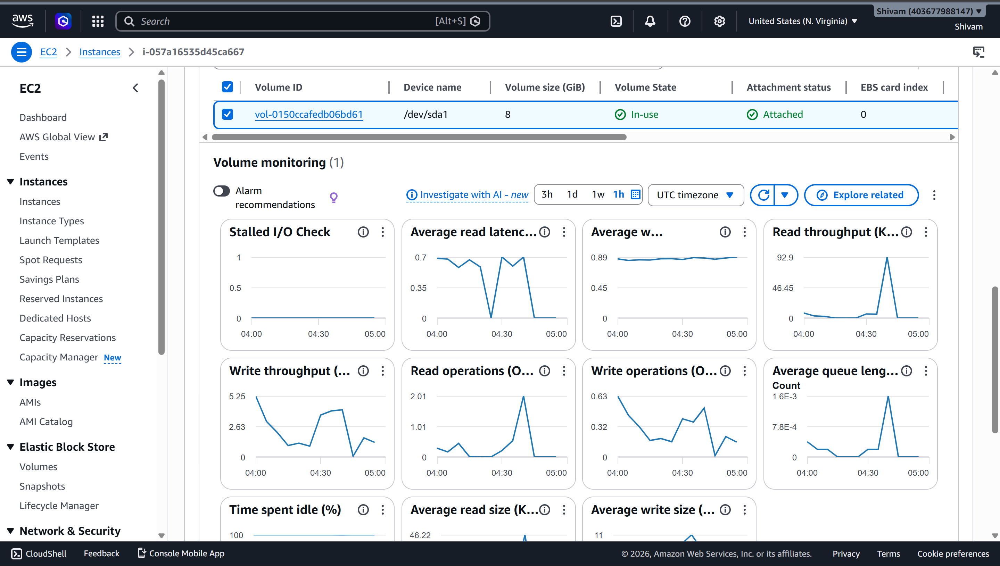
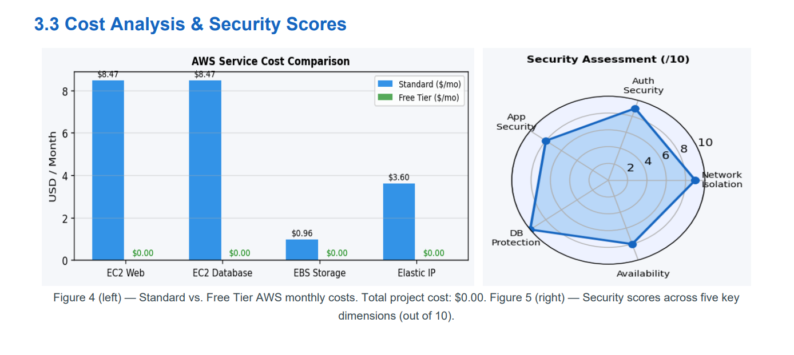

# Personal Finance App

A comprehensive personal finance management application built with Laravel. This application allows users to track their expenses, manage budgets, set financial goals, and gain insights into their financial habits through detailed reports. It features AI-powered transaction scanning using the Google Gemini API.

## Features

- **User Authentication**: Secure login, registration, and profile management using Laravel Breeze.
- **Dashboard**: A central hub providing an overview of your financial status.

  <p align="center">
    
  </p>
  <em>Dashboard — Overview of income, expenses, balance, savings rate, and Smart AI Advisor powered by Gemini.</em>
- **Transaction Management**: 
  - Add, edit, delete, and categorize your income and expenses.
  - **AI Receipt Scanning**: Automatically extract transaction details from receipts/images using the Gemini API.
  - Export transactions for external use.
- **Budgeting**: Set and monitor budgets for different categories to keep your spending in check.
- **Financial Goals**: Define savings goals and adjust your progress over time.
- **Interactive Reports**: Visualize your financial data with beautiful, interactive charts powered by Chart.js.

## Tech Stack

- **Backend**: Laravel 12 (PHP 8.2+)
- **Database**: MongoDB (via `mongodb/laravel-mongodb`)
- **Frontend**: Blade Templates, Tailwind CSS, Alpine.js
- **Assets Bundler**: Vite
- **Charts**: Chart.js
- **AI Integration**: Google Gemini API

## Prerequisites

Before you begin, ensure you have the following installed on your local machine:

- PHP >= 8.2
- Composer
- Node.js & npm
- MongoDB server (running locally or a remote MongoDB Atlas URI)
- Google Gemini API Key

## Installation

1. **Navigate to the project directory**:
   ```bash
   cd finance-app
   ```

2. **Run the setup script** (this will install dependencies, create the `.env` file, generate the app key, run migrations, and build assets):
   ```bash
   composer run setup
   ```
   
   *Alternatively, you can run the commands manually:*
   ```bash
   composer install
   cp .env.example .env
   php artisan key:generate
   npm install
   npm run build
   ```

3. **Configure Environment Variables**:
   Open your `.env` file and configure your database settings to use MongoDB. You also need to add your Gemini API key for the receipt scanning feature to work.
   
   ```env
   DB_CONNECTION=mongodb
   DB_URI=mongodb://localhost:27017/finance_app
   
   GEMINI_API_KEY=your_gemini_api_key_here
   ```

4. **Run Database Migrations** (if not done by the setup script):
   ```bash
   php artisan migrate
   ```

## Running the Application Locally

You can run the development server which will start the Laravel server, Vite, queue listener, and logs concurrently:

```bash
composer run dev
```

The application will be accessible at `http://localhost:8000`.

## System Architecture

<p align="center">
  
</p>
<em>Figure 1 — 2-Tier AWS Architecture. Users reach the Web EC2 (Public Subnet) via the Internet Gateway. The Web Server communicates with the Database EC2 exclusively over the private VPC network.</em>



## Implementation Plan

### Phase 1: Setup & Environment
- Provision an AWS EC2 instance (e.g., `t3.micro` running Ubuntu).
- Install required dependencies (PHP 8.2+, Composer, Node.js, npm).
- Clone the repository and configure the `.env` file (Database, API keys).

### Phase 2: Application Deployment
- Run `composer install` and `npm install`.
- Run database migrations using `php artisan migrate`.
- Build frontend assets using `npm run build`.

### Phase 3: Monitoring & Troubleshooting
- Monitor EC2 instance metrics (CPU, Network, Storage) via AWS CloudWatch.
- Ensure the `GEMINI_API_KEY` is correctly set in `.env` to avoid `API Error: 401` when accessing the Smart AI Advisor.
- Verify MongoDB connection strings if database errors occur.

## Deployment & Monitoring (Context)

Our application is currently deployed on an **AWS EC2 Instance**. Below are some important monitoring and configuration aspects based on the system context:

1. **Environment Configuration**: Environment variables such as database connection strings and the `GEMINI_API_KEY` are configured securely in the `.env` file on the server.
2. **AI Advisor Troubleshooting**: If the Gemini API key is missing or invalid, the Smart AI Advisor will display a `401 API Error` (as seen in the deployment logs). Ensure the key is active and correctly set in the environment.
3. **AWS Monitoring**: We utilize AWS CloudWatch dashboards to monitor the EC2 instance's health, including:
   - Volume monitoring (Read/Write throughput, Average queue length).

     <p align="center">
       
     </p>
     <em>EC2 Volume Monitoring — Stalled I/O checks, read/write latency, throughput, and queue length metrics.</em>
   - Network utilization (Bytes in/out, Packets).
   - CPU utilization to ensure the `t3.micro` instance is performing optimally.

## Cost Analysis & Security

<p align="center">
  
</p>
<em>Figure 4 (left) — Standard vs. Free Tier AWS monthly costs. Total project cost: $0.00. Figure 5 (right) — Security scores across five key dimensions (out of 10).</em>

## License

This project is open-sourced software licensed under the [MIT license](https://opensource.org/licenses/MIT).
